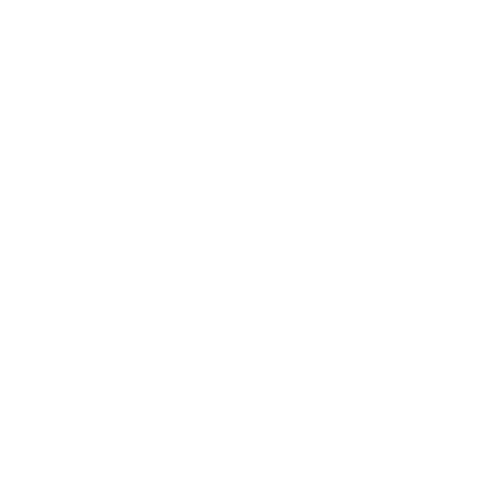

  

Electrical engineering and information technology student exploring cybersecurity and systems programming.

Open Source the World  

  More is brewing in private repositories.

###

  
  
  
  
  
  
  
  
  
  
  
  
  
  
  
  
  

###

<picture>
  <source media="(prefers-color-scheme: dark)" srcset="https://raw.githubusercontent.com/Darkroom4364/Darkroom4364/output/pacman-contribution-graph-dark.svg">
  <source media="(prefers-color-scheme: light)" srcset="https://raw.githubusercontent.com/Darkroom4364/Darkroom4364/output/pacman-contribution-graph.svg">
  
</picture>

###

  

###